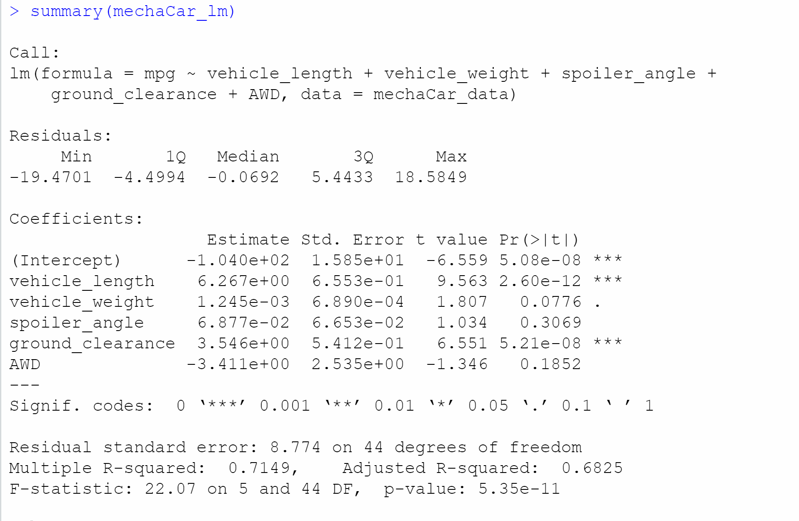
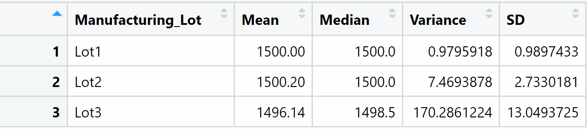
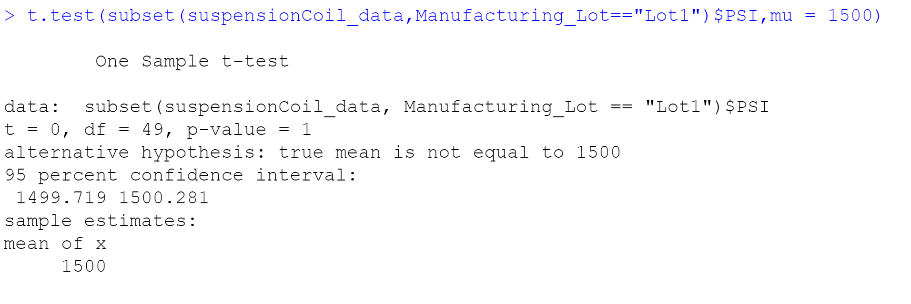
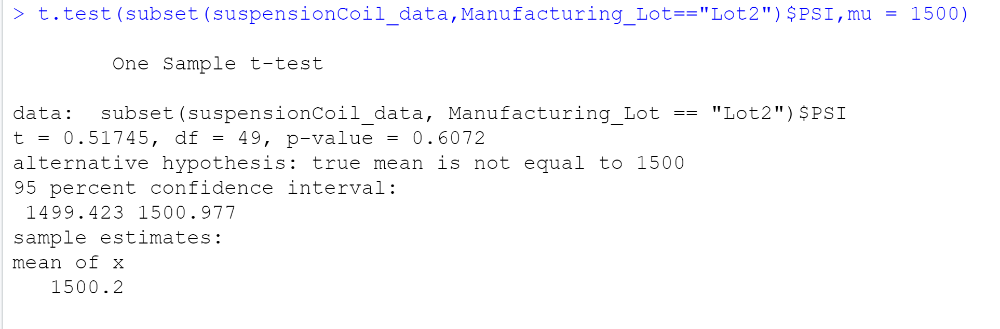
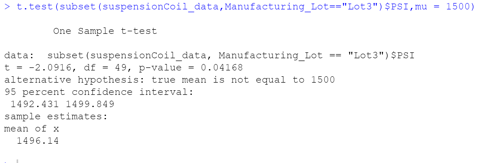
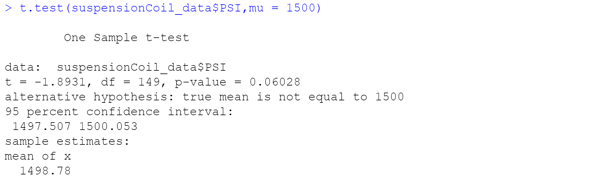

## Linear Regression to Predict

- The variable that gives a non-irregular measure of difference to the mpg values in the dataset is vehicle length and vehicle ground freedom since they altogether affect miles per gallon on the mechanical model. The p-upsides of vehicle weight, spoiler point, and all-wheel drive demonstrate an arbitrary measure of difference with the dataset. 

- The incline of this straight model isn't zero in light of the fact that the p-worth of this model is 5.35e-11 which is more modest than the critical degree of 0.05% and furthermore gives adequate proof to dismiss the invalid speculation. 

- The straight model predicts the mpg of MechaCar models viably on the grounds that the r-squared worth is 0.7149, which implies about 71% of all mpg expectations will be dictated by this model.

## Summary Statistics on Suspension

- Taking a statistics at rundown insights for the PSI of MechaCar suspension curls the change of the loops is 62.29PSI, which meets the necessities determinations for the MechaCar suspension curls that direct that the difference of the suspension curls should not surpass 100.

- Taking a statistics at the synopsis insights for each MechaCar Manufacturing part PSI, Lot 1 and Lot 2 meet the necessary particulars for the MechaCar suspension loops; with a fluctuation of 0.98 and 7.47. Be that as it may, Lot 3 is showing a lot bigger difference of 170.29, subsequently, doesn't meet the necessary determinations for MechaCar suspension loops.

## T-Tests on Suspension Coils

- The p-value incentive for all assembling parcels is 0.06, which is over the 0.05% huge level, which implies that this information isn't genuinely critical and demonstrates solid proof for the invalid theory.

- The p-value incentive for all assembling parts is 1, which is over the 0.05% critical level. which implies that this information isn't genuinely critical and shows solid proof for the invalid speculation.

-The p-value incentive for all assembling parts is 0.61, which is over the 0.05% huge level, which implies that this information isn't measurably huge and demonstrates solid proof for the invalid speculation.

- The p-value incentive for all assembling parts is 0.04, which is underneath the 0.05% huge level, which implies it is genuinely critical. It shows solid proof against the invalid theory, as there is not exactly a 5% likelihood the invalid is right (and the outcomes are arbitrary).

## Study Design: MechaCar vs Competition

- I would lead a One-Sample T-test which can measure how the MechaCar performs against the contest. The metric I would utilize is strength since it manages the exhibition of the vehicle. A strength is a unit of estimation that references the yield motors or engines. A one-example T-test would be ideal to discover is there a statical distinction. The invalid theory is that there is no factual distinction between MechaCar strength versus the contenders. The elective speculation is that there is a measurable distinction between MechaCar torque versus the contenders. The information required are the strength information, the example implies, the populace implies, test standard deviation, and the quantity of perceptions.
